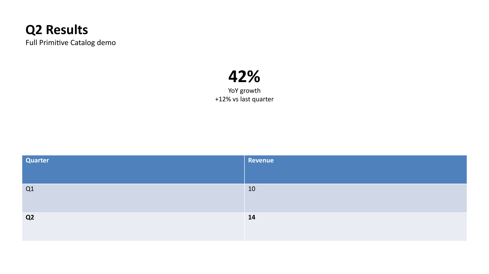
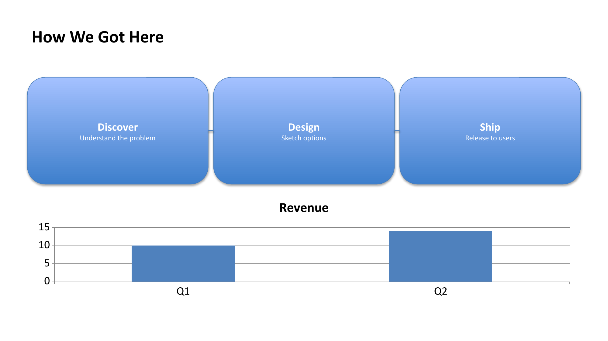

# compono

**Agent-oriented, code-based PPTX generation — "Manim, but for PowerPoint."**

compono lets an LLM agent (or a human) describe a slide deck as data —
headers, bullet text, stats, tables, charts, images, process sequences,
shapes — and get back a real, editable `.pptx` file. The agent never writes
raw `x`/`y`/`w`/`h` coordinates: a constraint-based layout resolver computes
every position from a small set of typed primitives.

Every rendered element is a genuine, editable native shape (`p:sp`, `p:pic`,
`p:graphicFrame`) — never a flattened image or embedded video. Open the
result in PowerPoint and drag a box around; it's a real object, not a
picture of one.

This file is both the human-facing README and the in-context reference an
agent uses to call compono correctly — see `skills/compono/SKILL.md` for the
packaged version of the same content.

## See it in action

Rendered directly from `examples/full_catalog.json` (`.pptx` → PNG via
LibreOffice, see `scripts/render_example_screenshots.py`) — nothing here is
a mockup:

| | |
|---|---|
|  |  |

## Install

```bash
pip install compono
# or
uv add compono
```

For local development, see `CONTRIBUTING.md`.

## Quickstart

```python
from compono import render_deck

spec = {
    "slides": [
        {
            "header": {"title": "Q3 Results", "subtitle": "Engineering team"},
            "body": [
                {
                    "primitive": "text",
                    "mode": "bullets",
                    "content": [
                        "Shipped the new layout resolver",
                        "Cut render time by 40%",
                        "Zero overflow bugs in production",
                    ],
                    "emphasis_indices": [1],
                }
            ],
        }
    ]
}

report = render_deck(spec, "deck.pptx")
print(report.pptx_path, report.warnings)
```

Or from the command line:

```bash
compono validate spec.json
compono render spec.json -o deck.pptx
```

## Core concepts

- **One entry point, two verbs.** `render_deck(spec, output_path)` and
  `validate(spec)` are the only two functions you need. `validate` is cheap
  — no pptx write, millisecond-scale — so an agent can iterate on a spec
  before paying render cost.
- **A spec is plain data.** Either a raw `dict`/JSON (what an agent's
  tool-calling naturally produces) or the typed builder classes
  (`Deck`, `Header`, `Text`, ...) — both serialize to the identical shape.
  There's no divergence between the two paths.
- **You never write coordinates.** Every primitive claims space in a slide;
  the resolver (a CSS-flexbox-style directional box model) computes real
  EMU positions. `grid` is the one primitive that does true 2D
  row/column math.
- **Errors are fixes, not diagnoses.** Every validation/render failure is
  `{slide, primitive, field, error, detail, fix}` — see
  [Error shape](#error-shape) below.
- **render_deck returns a report, not just a file** —
  `{pptx_path, manifest, warnings, actual_layout}` — so an agent can reason
  about what happened without reopening the file.

## API reference

```python
from compono import (
    render_deck, validate,
    Deck, Slide, Header, Text, Image, Stat, Grid, Table, Sequence, Chart, Shape,
    DeckValidationError,
)
```

| Symbol | Signature | Notes |
|---|---|---|
| `render_deck` | `render_deck(spec, output_path, *, template=None) -> RenderReport` | Validates, resolves layout, writes a real `.pptx`. Raises `DeckValidationError` on any error — nothing is written on failure. |
| `validate` | `validate(spec, *, template=None) -> ValidationReport` | Schema + layout + text-overflow checks. No file I/O. Never raises — check `.valid`/`.errors`. |
| `DeckValidationError` | `exc.errors -> list[dict]` | The one exception type. Carries the structured error list below. |

A `Deck` is `{template?: str, slides: [Slide, ...]}`. A `Slide` is
`{header?: Header, body: [primitive, ...], notes?: str}`. `body` (and
`grid.items`) accept any primitive, keyed by its `"primitive"` field.

### Error shape

```json
{
  "slide": 3,
  "primitive": "grid.items[1]",
  "field": "content",
  "error": "overflow",
  "detail": "Text is ~14pt too tall for the box at font size 18pt (6 lines).",
  "fix": "Shorten the text, reduce bullet/line count, or split into two slides."
}
```

## Primitive catalog

Every primitive accepts an optional `id` (needed if another primitive
references it, e.g. a connector) and an optional `notes` (speaker notes).

| Primitive | Key fields | Purpose |
|---|---|---|
| `header` | `title`, `subtitle?`, `eyebrow?`, `align` | Slide title region. |
| `text` | `mode` (paragraph/bullets), `content`, `columns?`, `emphasis_indices?` | Prose or bullet list. |
| `image` | `src?`, `placeholder`, `caption?`, `fit` (cover/contain) | A real picture, or a first-class placeholder — see below. |
| `stat` | `value`, `label`, `trend?` | A headline number with a label. |
| `grid` | `items`, `columns`, `direction`, `align`, `justify` | The one primitive with true 2D layout. Items can be any primitive, including nested grids. |
| `table` | `headers`, `rows`, `emphasis_row?`, `emphasis_col?` | Renders as a real OOXML table (`p:graphicFrame`), not an image. |
| `sequence` | `steps` (`{label, description?}`), `orientation` | A row/column of connected step boxes — process/timeline diagrams. |
| `chart` | `chart_type` (bar/line/pie), `categories`, `series` | A real, editable native chart with live data — not a picture of a chart. |
| `shape` | `kind` (rect/rounded_rect/oval/line/arrow/connector), `fill`, `border`, `connects?`, `text?` | Freeform shape, optionally with text inside, or a connector between two other primitives by `id`. |

Every schema field's description is written as an instruction (e.g. "Keep
under ~60 characters — longer titles will be shrunk by the resolver"), not
a bare type label — call `Header.model_json_schema()` (or any primitive
class) to get the full JSON Schema with these descriptions inline.

### Image placeholders

Set `"placeholder": true` (with an optional `caption`) instead of `src` when
you don't have a real image yet. It renders as an intentional design
element — dashed border, centered caption — and `render_deck`'s
`RenderReport.manifest` gets one entry per placeholder:
`{slide, primitive, rect: {x, y, w, h}, caption}`. A later pass (image
search/generation/human upload) can fill each reserved rect directly from
the manifest EMU rect — no re-layout needed, and the deck-building agent
itself never needs image-generation capability.

## Worked examples

### 1. Title slide

```json
{
  "slides": [
    { "header": { "title": "2026 Roadmap", "subtitle": "Platform team", "eyebrow": "Q1 Kickoff" } }
  ]
}
```

### 2. Two-column comparison with a connector

```json
{
  "slides": [{
    "header": { "title": "Before vs. After" },
    "body": [
      {
        "primitive": "grid",
        "columns": 2,
        "items": [
          { "id": "before", "primitive": "shape", "kind": "rounded_rect", "fill": "#EF4444",
            "text": { "content": "Manual layout" } },
          { "id": "after", "primitive": "shape", "kind": "rounded_rect", "fill": "#10B981",
            "text": { "content": "Resolver-computed layout" } }
        ]
      },
      { "primitive": "shape", "kind": "connector", "connects": { "from_id": "before", "to_id": "after" } }
    ]
  }]
}
```

### 3. Stat + table + chart dashboard

```json
{
  "slides": [{
    "header": { "title": "Q3 Metrics" },
    "body": [
      { "primitive": "stat", "value": "42%", "label": "YoY growth", "trend": "+12% vs Q2" },
      { "primitive": "table", "headers": ["Quarter", "Revenue"], "rows": [["Q1", "10"], ["Q2", "14"]] },
      { "primitive": "chart", "chart_type": "bar", "categories": ["Q1", "Q2"],
        "series": [{ "name": "Revenue", "values": [10, 14] }] }
    ]
  }]
}
```

### 4. Process sequence

```json
{
  "slides": [{
    "header": { "title": "Our Process" },
    "body": [{
      "primitive": "sequence",
      "orientation": "horizontal",
      "steps": [
        { "label": "Discover", "description": "Understand the problem" },
        { "label": "Design", "description": "Sketch options" },
        { "label": "Ship", "description": "Release to users" }
      ]
    }]
  }]
}
```

See `examples/minimal.json` and `examples/full_catalog.json` for complete,
runnable specs (also used as test fixtures).

## Fonts and overflow validation

Overflow checking (`validate`'s layout errors, and the "shrink text on
overflow" behavior it protects against) reads real glyph advance widths via
`fonttools` — no rendering required. As of this release, no font is bundled
into the package yet (`src/compono/fonts/` is a placeholder); validation
falls back to a system font if one is found (e.g. `arial.ttf` on Windows),
and is skipped — not faked — with a warning if none is available. A bundled,
OFL-licensed safe-font list is planned before the first tagged release; this
section will list it once shipped.

## CLI

```bash
compono validate spec.json
compono render spec.json --template fractal -o deck.pptx
```

Mirrors `validate`/`render_deck` exactly — useful for agent frameworks that
can only shell out rather than import Python.

## MCP server

[`compono-mcp`](packages/compono-mcp) exposes `validate`/`render_deck` as MCP
tools, for any MCP-compatible client — not just Claude Code.

```bash
pip install compono-mcp
# or
uv add compono-mcp
```

Add to your MCP client config (Claude Desktop / Claude Code style):

```json
{ "mcpServers": { "compono": { "command": "compono-mcp" } } }
```

Exposes `validate_deck`/`render_deck_tool` tools (identical `spec` shape to
the Python API) and a `compono://reference` resource carrying the full
agent-facing reference doc, for clients without Claude Code's skill system.

## Claude Code plugin

This repo is also a Claude Code plugin marketplace, bundling the
`skills/compono/SKILL.md` reference doc as an installable skill:

```
/plugin marketplace add Shaik-Hamzah123/compono
/plugin install compono
```

## Contributing

See `CONTRIBUTING.md` for dev setup, branching, and code style. If you're
using Claude Code, `.claude/README.md` describes the build-workflow skill,
review subagent, and commit/format hooks set up for this repo.
