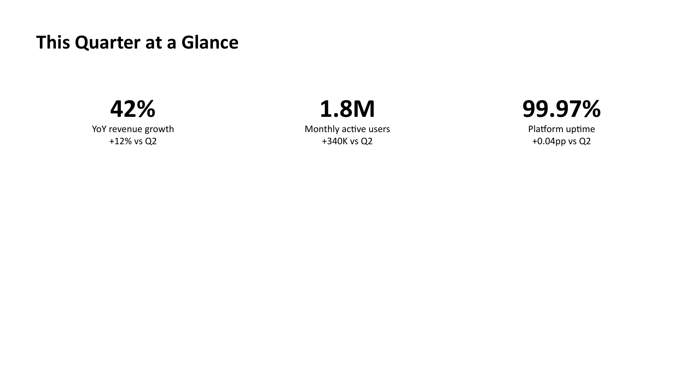
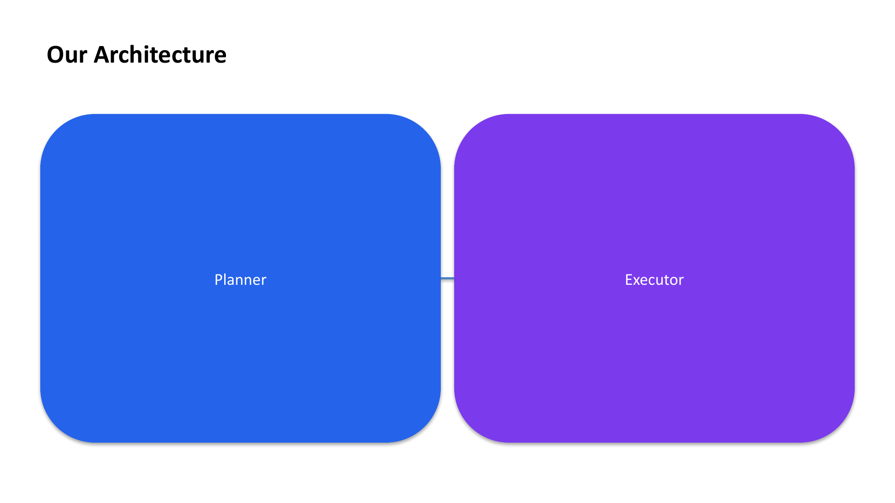
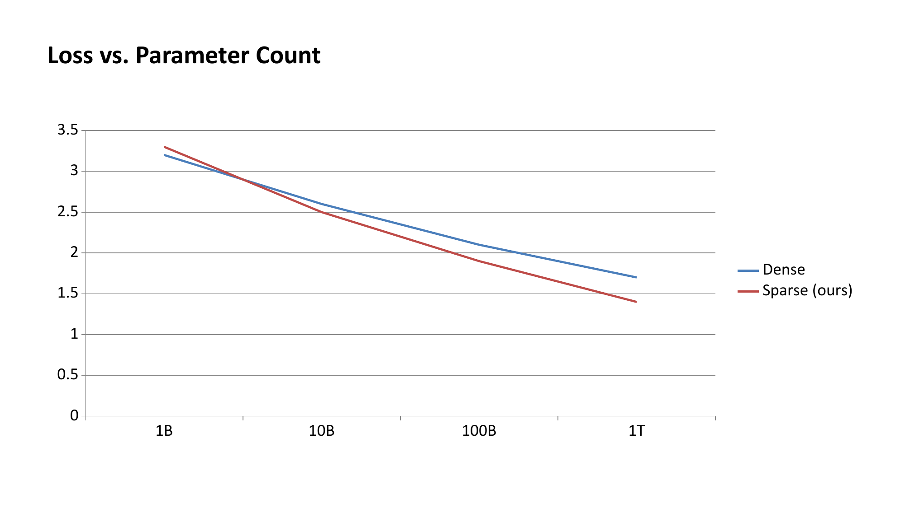
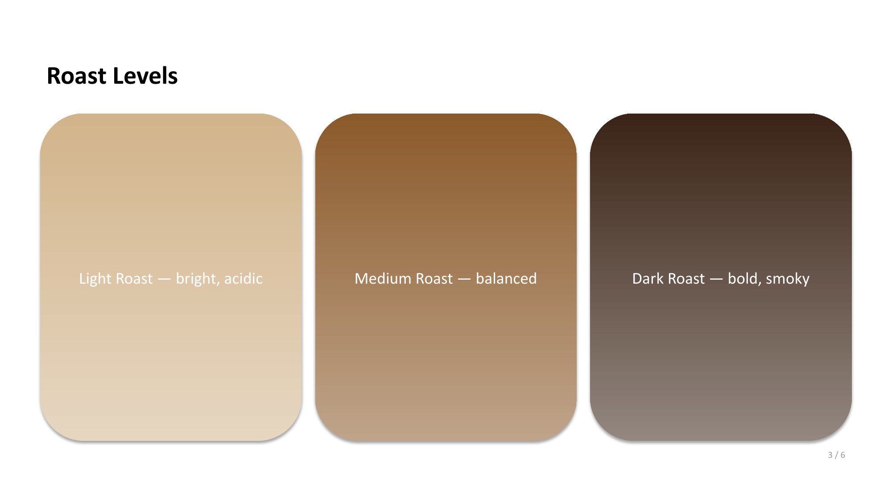
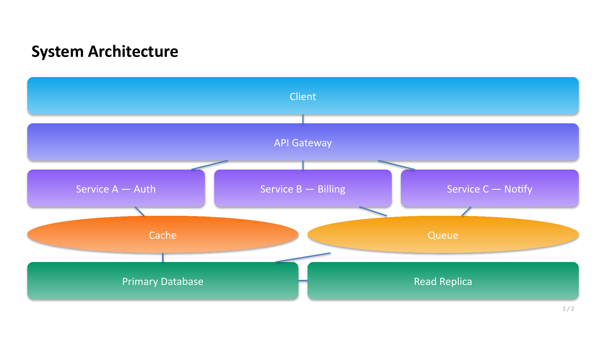

# Examples

## See it in action

compono isn't scoped to one deck genre — the same primitives compose into
client proposals, conference talks, research talks, college presentations,
or a lighter explainer. Every image below is rendered directly from the
matching `../examples/*.json` spec (`.pptx` → PNG via LibreOffice, see
`../scripts/render_example_screenshots.py`) — nothing here is a mockup:

| Client proposal | Conference talk |
|---|---|
|  |  |

| Research talk | Fun explainer |
|---|---|
|  |  |

`shape` + `connector` compose into real diagrams, not just colored boxes —
a layered system architecture, built entirely from `../examples/architecture_diagram.json`:



See `../examples/` for the full specs (`client_proposal.json`,
`conference_talk.json`, `research_talk.json`, `college_presentation.json`,
`fun_explainer.json`, `architecture_diagram.json`, `rag_pipeline_diagram.json`,
`gantt_timeline.json`, and `full_catalog.json`).

## Rendering any of these

Every spec here is plain JSON — the exact same file renders through either
implementation, no changes needed.

**Python** (CLI):

```bash
compono render examples/client_proposal.json -o deck.pptx
```

**Python** (code):

```python
import json
from compono import render_deck

spec = json.load(open("examples/client_proposal.json"))
report = render_deck(spec, "deck.pptx")
print(report.pptx_path, report.warnings)
```

**JS/TS** (CLI):

```bash
npx --package=@skhamzah123/compono-js compono-js render examples/client_proposal.json -o deck.pptx
```

**JS/TS** (code):

```ts
import { readFileSync } from "node:fs";
import { renderDeck } from "@skhamzah123/compono-js";

const spec = JSON.parse(readFileSync("examples/client_proposal.json", "utf-8"));
const report = await renderDeck(spec, "deck.pptx");
console.log(report.pptxPath, report.warnings);
```


